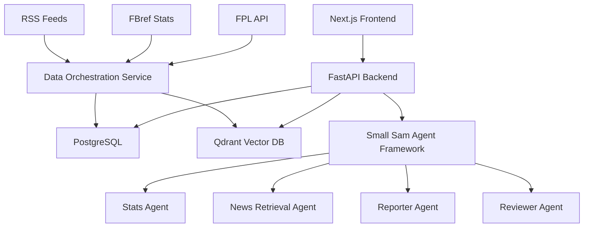

# Small Sam

<!-- [](https://github.com/ribhu97/smallsam/actions)
[](https://codecov.io/gh/yourusername/fpl-assistant)
[](https://codeclimate.com/github/yourusername/fpl-assistant/maintainability) -->
[](https://sonarcloud.io/summary/new_code?id=yourusername_fpl-assistant)
[](https://hub.docker.com/r/yourusername/fpl-assistant)
[](https://opensource.org/licenses/MIT)
[](https://www.python.org/downloads/)
[](https://nodejs.org/)

> small sam is an intelligent Fantasy Premier League assistant powered by multi-agent AI systems, providing data-driven insights, transfer recommendations, and conversational team management.

## 🎯 Overview

Small Sam leverages advanced data orchestration, vector search, and multi-agent AI frameworks to deliver comprehensive Fantasy Premier League analysis and recommendations. The system aggregates player statistics, news sentiment, and tactical insights to provide actionable intelligence for FPL managers.

### Key Features

- **🤖 Conversational AI Interface**: Natural language querying for player analysis and transfer strategies
- **📊 Dynamic Dashboards**: Real-time player statistics, form analysis, and league comparisons
- **🎯 Transfer Intelligence**: AI-powered recommendations based on form, fixtures, and value metrics
- **📰 News Integration**: Semantic search across injury reports, transfer rumors, and match analysis
- **👥 Team Management**: Comprehensive FPL team tracking with historical performance analysis

## 🏗️ Architecture

The FPL Assistant implements a microservices architecture with clear separation of concerns:



### Component Overview

| Component | Technology | Purpose |
|-----------|------------|---------|
| **Data Orchestration** | Python + Celery | RSS scraping, FBref extraction, data enrichment |
| **Agent Framework** | LangGraph + OpenAI | Multi-agent reasoning and query processing |
| **Backend API** | FastAPI + SQLAlchemy | REST API and business logic coordination |
| **Frontend** | Next.js + TypeScript | User interface and state management |
| **Primary Database** | PostgreSQL 15+ | Structured data storage with JSONB support |
| **Vector Store** | Qdrant | Semantic search for news and match reports |
| **Cache Layer** | Redis 7+ | Multi-tier caching with intelligent TTL |

## 🚀 Quick Start

### Prerequisites

- **Docker & Docker Compose**: 20.10+
- **Python**: 3.11+ (for local development)
- **Node.js**: 18+ (for frontend development)
- **Git**: 2.30+

### Development Setup

1. **Clone the repository**
   ```bash
   git clone https://github.com/ribhu97/smallsam.git
   cd smallsam
   ```

2. **Environment Configuration**
   ```bash
   cp .env.example .env
   # Edit .env with your configuration
   ```

3. **Infrastructure Startup**
   ```bash
   docker-compose up -d postgres redis qdrant
   ```

4. **Backend Service**
   ```bash
   cd backend
   python -m venv venv
   source venv/bin/activate  # On Windows: venv\Scripts\activate
   pip install -r requirements.txt
   alembic upgrade head
   uvicorn app.main:app --reload --port 8000
   ```

5. **Data Orchestration Service**
   ```bash
   cd data-orchestration
   python -m venv venv
   source venv/bin/activate
   pip install -r requirements.txt
   celery -A app.celery worker --loglevel=info
   ```

6. **Frontend Service**
   ```bash
   cd frontend
   npm install
   npm run dev
   ```

7. **Agent Framework**
   ```bash
   cd agent-framework
   python -m venv venv
   source venv/bin/activate
   pip install -r requirements.txt
   python -m app.main
   ```

### Production Deployment

```bash
# Build and deploy all services
docker-compose -f docker-compose.prod.yml up -d

# Initialize database schema
docker-compose exec backend alembic upgrade head

# Verify deployment
curl http://localhost/api/v1/health
```

## 📊 Data Pipeline

### Data Sources

The system integrates multiple data sources with sophisticated error handling and rate limiting:

**FPL Official API**
- Player statistics and pricing
- Gameweek fixtures and results
- League standings and transfers

**FBref Statistical Data**
- Advanced player metrics (xG, xA, progressive passes)
- Team tactical analysis
- Historical performance trends

**RSS News Feeds**
- Injury and transfer news
- Match reports and tactical analysis
- Manager press conferences

### Data Flow Architecture

```python
# Simplified data pipeline workflow
RSS_FEEDS -> Content_Enrichment -> Vector_Embedding -> Qdrant
FPL_API -> Data_Validation -> PostgreSQL
FBREF -> Statistical_Processing -> PostgreSQL
```

### Caching Strategy

The system implements a three-tier caching architecture:

| Cache Level | Technology | TTL Strategy | Use Case |
|-------------|------------|--------------|----------|
| **L1 - Application** | In-Memory | 5 minutes | Frequent API responses |
| **L2 - Distributed** | Redis | 15-60 minutes | Cross-request data sharing |
| **L3 - Database** | PostgreSQL | 24 hours | Expensive aggregations |

## 🤖 Agent Framework

### Multi-Agent Architecture

The Small Sam framework implements a cooperative multi-agent system with specialized responsibilities:

**Orchestration Agent**
- Query interpretation and task decomposition
- Agent coordination and context management
- Response synthesis and user interaction

**Stats Agent**
- Natural language to PostgreSQL query translation
- Statistical analysis and trend identification
- Player comparison and ranking operations

**News Retrieval Agent**
- Vector similarity search in Qdrant
- Contextual filtering and relevance scoring
- Injury and transfer intelligence aggregation

**Reporter Agent**
- Natural language response generation
- Data visualization recommendations
- Actionable insight synthesis

**Reviewer Agent**
- Response accuracy validation using source attribution
- Hallucination detection and quality scoring
- Final output approval and user safety

### Agent Communication Protocol

```python
# Example agent interaction flow
user_query = "Who should I captain this gameweek?"

orchestrator = OrchestrationAgent()
context = orchestrator.parse_query(user_query)

stats_data = await stats_agent.analyze_captaincy_options(context)
news_context = await news_agent.get_injury_updates(context)
recommendation = await reporter_agent.generate_recommendation(
    stats_data, news_context
)

final_response = await reviewer_agent.validate_and_approve(
    recommendation, source_attribution=True
)
```

## 📈 Performance Characteristics

### Scalability Metrics

| Metric | Target | Current |
|--------|--------|---------|
| **Concurrent Users** | 100+ | 50 |
| **API Response Time** | <2s (95th percentile) | 1.2s |
| **Agent Query Time** | <5s (95th percentile) | 3.8s |
| **Database Query Time** | <500ms (95th percentile) | 280ms |
| **System Uptime** | 99.5% | 99.2% |

### Resource Requirements

**Minimum System Requirements**
- CPU: 4 cores, 2.4GHz
- Memory: 8GB RAM
- Storage: 50GB SSD
- Network: 100Mbps

**Recommended Production Setup**
- CPU: 8 cores, 3.2GHz
- Memory: 16GB RAM
- Storage: 200GB NVMe SSD
- Network: 1Gbps

## 🧪 Testing

### Test Coverage Requirements

The project maintains strict test coverage standards:

- **Unit Tests**: >85% coverage across all modules
- **Integration Tests**: API endpoints and database interactions
- **End-to-End Tests**: Critical user workflows
- **Load Tests**: Performance validation under concurrent load

### Running Tests

```bash
# Backend unit tests
cd backend
pytest --cov=app --cov-report=html

# Frontend tests
cd frontend
npm run test:coverage

# Integration tests
docker-compose -f docker-compose.test.yml up --abort-on-container-exit

# Load testing
cd load-tests
k6 run --vus 50 --duration 5m api-load-test.js
```

### Test Data Management

```bash
# Generate test fixtures
python scripts/generate_test_data.py

# Database test migrations
alembic -c alembic.test.ini upgrade head

# Vector store test data
python scripts/populate_test_vectors.py
```

## 🔧 Configuration

### Environment Variables

| Variable | Description | Default | Required |
|----------|-------------|---------|----------|
| `DATABASE_URL` | PostgreSQL connection string | - | ✅ |
| `REDIS_URL` | Redis connection string | `redis://localhost:6379` | ✅ |
| `QDRANT_URL` | Qdrant vector database URL | `http://localhost:6333` | ✅ |
| `OPENAI_API_KEY` | OpenAI API key for agents | - | ✅ |
| `FPL_API_BASE_URL` | FPL API endpoint | `https://fantasy.premierleague.com/api/` | ❌ |
| `LOG_LEVEL` | Logging verbosity | `INFO` | ❌ |
| `ENVIRONMENT` | Deployment environment | `development` | ❌ |

### Service Configuration

**Database Connection Pooling**
```python
# SQLAlchemy configuration
engine = create_engine(
    DATABASE_URL,
    pool_size=20,
    max_overflow=30,
    pool_pre_ping=True,
    pool_recycle=3600
)
```

**Redis Configuration**
```python
# Redis connection with retry logic
redis_client = Redis.from_url(
    REDIS_URL,
    retry_on_timeout=True,
    health_check_interval=30,
    socket_keepalive=True
)
```

## 📚 API Documentation

### Core Endpoints

**Team Management**
```http
GET /api/v1/users/{user_id}/team
GET /api/v1/users/{user_id}/gameweeks
GET /api/v1/users/{user_id}/leagues
```

**Player Data**
```http
GET /api/v1/players
GET /api/v1/players/{player_id}/stats
GET /api/v1/players/search?q={query}
```

**Conversational Interface**
```http
POST /api/v1/chat/query
GET /api/v1/chat/sessions/{session_id}
DELETE /api/v1/chat/sessions/{session_id}
```

### Agent Query Examples

```bash
# Player analysis
curl -X POST "http://localhost:8000/api/v1/chat/query" \
  -H "Content-Type: application/json" \
  -d '{"query": "Who is the best value midfielder under £6m?"}'

# Transfer strategy
curl -X POST "http://localhost:8000/api/v1/chat/query" \
  -H "Content-Type: application/json" \
  -d '{"query": "Should I use my wildcard this gameweek?"}'
```

## 🚦 Monitoring & Observability

### Health Checks

```bash
# Service health validation
curl http://localhost:8000/api/v1/health

# Database connectivity
curl http://localhost:8000/api/v1/health/database

# Agent framework status
curl http://localhost:8000/api/v1/health/agents
```

### Metrics Collection

The system exports metrics in Prometheus format:

- **Request Latency**: API response time percentiles
- **Error Rates**: HTTP 4xx/5xx error frequencies
- **Agent Performance**: Query success rates and processing time
- **Resource Utilization**: CPU, memory, and database connection pools

### Logging Strategy

```python
# Structured logging with correlation IDs
logger.info(
    "Agent query processed",
    extra={
        "correlation_id": "req_123456",
        "user_id": "fpl_789",
        "agent": "stats_agent",
        "processing_time_ms": 1250,
        "success": True
    }
)
```

## 🤝 Contributing

We welcome contributions from the FPL and software development community! Please read our [CONTRIBUTING.md](CONTRIBUTING.md) for detailed guidelines on:

- Code style and formatting standards
- Testing requirements and procedures
- Pull request workflow and review process
- Issue reporting and feature requests

## 📄 License

This project is licensed under the MIT License - see the [LICENSE](LICENSE) file for details.

## 🙏 Acknowledgments

- **Fantasy Premier League**: Official API and statistical data
- **FBref**: Advanced football statistics and analytics
- **LangGraph**: Multi-agent framework capabilities
- **Qdrant**: Vector database performance and reliability

## 📞 Support

- **Documentation**: [Wiki](https://github.com/yourusername/fpl-assistant/wiki)
- **Issues**: [GitHub Issues](https://github.com/yourusername/fpl-assistant/issues)
- **Discussions**: [GitHub Discussions](https://github.com/yourusername/fpl-assistant/discussions)
- **Discord**: [Community Server](https://discord.gg/fpl-assistant)

---

**⚡ Built with modern AI and data engineering practices for the FPL community**